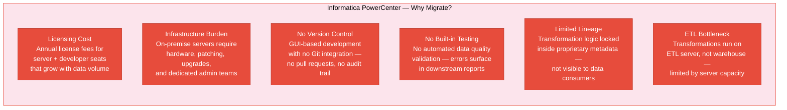
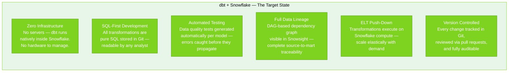
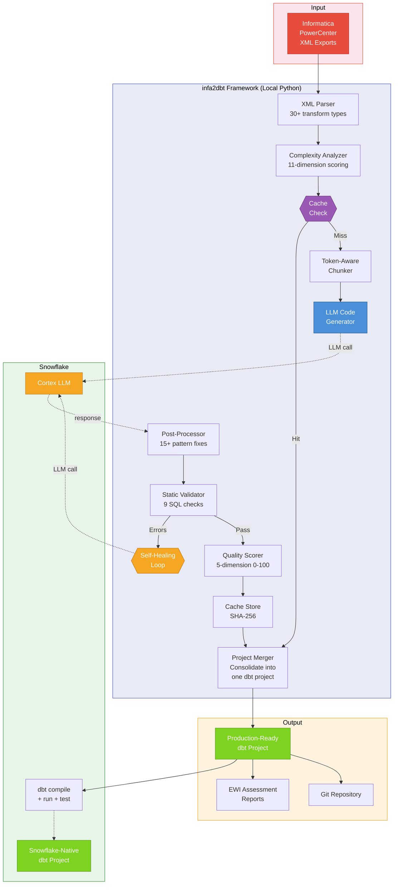
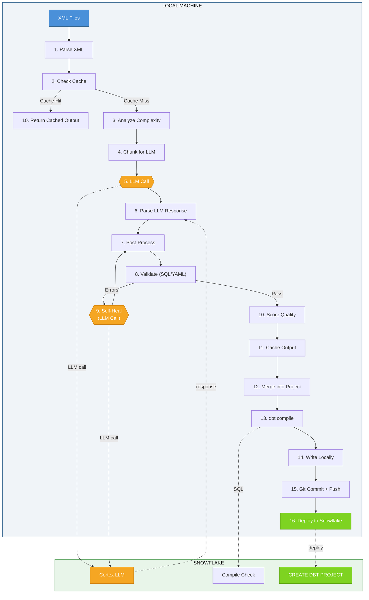
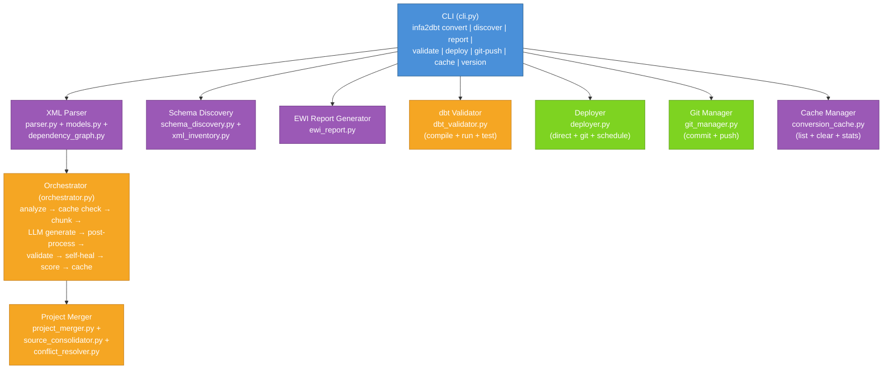
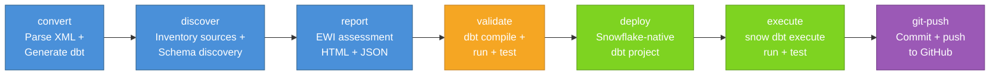
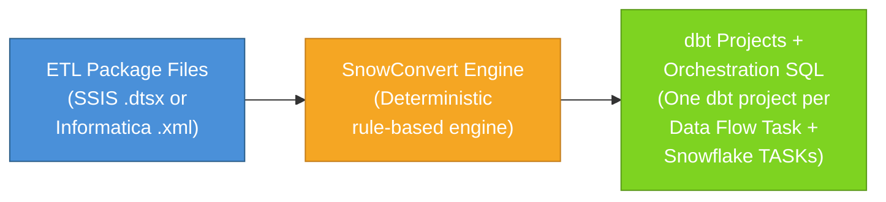
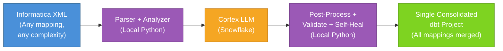
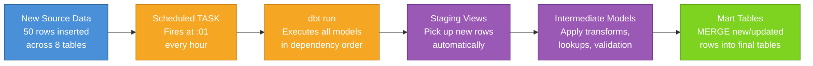
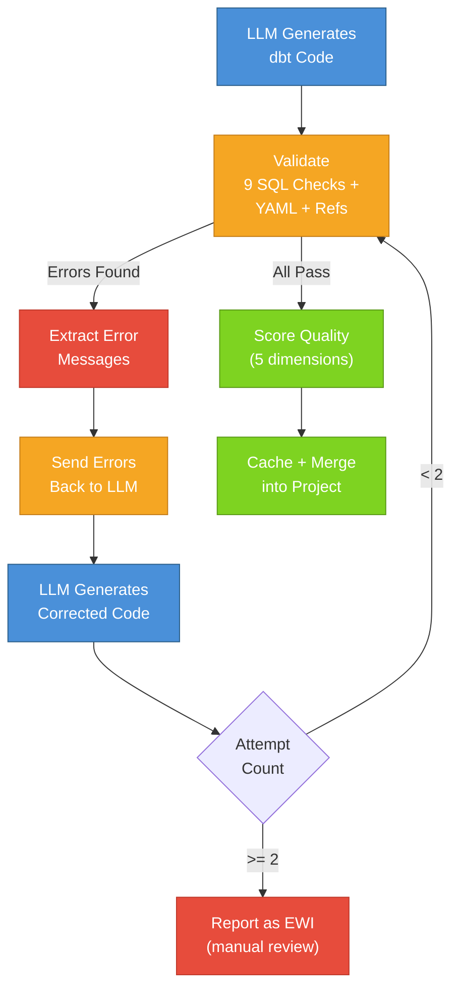

# Consolidated Guide — infa2dbt Framework


| Field | Value |
|-------|-------|
| **Topic Focus** | Industrialized framework — generic, reusable, production-grade |
| **Key Message** | From prototype to production: a standardized, LLM-powered migration framework that converts any Informatica PowerCenter mapping to Snowflake-native dbt |

---

## Table of Contents

1. [The Migration Challenge (2 min)](#1-the-migration-challenge-2-min)
2. [Framework Architecture (4 min)](#2-framework-architecture-4-min)
3. [SnowConvert AI vs infa2dbt (3 min)](#3-snowconvert-ai-vs-infa2dbt-3-min)
4. [Conversion Results — 3 Real Mappings (8 min)](#4-conversion-results--3-real-mappings-8-min)
5. [Live Pipeline on Snowflake (5 min)](#5-live-pipeline-on-snowflake-5-min)
6. [Framework Differentiators (3 min)](#6-framework-differentiators-3-min)
7. [Run It Yourself — Cortex Code Prompt (3 min)](#7-run-it-yourself--cortex-code-prompt-3-min)
8. [Summary and Next Steps (2 min)](#8-summary-and-next-steps-2-min)

---

## 1. The Migration Challenge (2 min)

> **Speaker Notes**: Start by establishing the problem. The customer already knows Informatica — focus on why staying on it is costly, and why dbt + Snowflake is the right target. Then introduce infa2dbt as the bridge.

### 1.1 Informatica PowerCenter — Pain Points

Organizations running Informatica PowerCenter face compounding challenges that grow with every year of continued investment:



### 1.2 dbt + Snowflake — The Target State

The target architecture eliminates every pain point above:



### 1.3 The Challenge — How Do You Get There?

The question is not *whether* to migrate, but *how* to migrate hundreds of Informatica mappings without a multi-year manual effort:

| Approach | Per-Mapping Effort | Quality Risk | Scalability | Testing |
|----------|-------------------|--------------|-------------|---------|
| **Manual rewrite** | Days per mapping | High — human error, inconsistency | Does not scale beyond 10-20 mappings | Manual — often skipped |
| **SnowConvert AI** (rule-based) | Seconds | Medium — EWIs for unsupported patterns | Limited to supported transforms (~15 functions) | None — user must write tests |
| **infa2dbt** (LLM-powered) | **30-60 seconds** | **Low — self-healing + auto-tests** | **Any mapping, any complexity** | **Auto-generated per model** |

> **Speaker Notes**: Pause here. "We started with a notebook-based prototype to prove the concept. What you're about to see is the industrialized version — a generic, reusable framework with a CLI, automated testing, self-healing, and one-command deployment."

---

## 2. Framework Architecture (4 min)

> **Speaker Notes**: Walk through the architecture top-down. Start with the high-level view (what goes in, what comes out), then show the internal pipeline, the component layout, and the execution order. Emphasize: this is not a script — it is a production-grade framework.

### 2.1 High-Level Architecture

The framework takes any Informatica PowerCenter XML export as input and produces a complete, tested, deployable Snowflake-native dbt project as output:



### 2.2 Local Execution Flow

The internal pipeline runs 16 steps from XML input to Snowflake deployment. Most steps run locally — only LLM generation and deployment require Snowflake connectivity:



### 2.3 Component Architecture

The CLI is the user's single entry point. Each command routes to a dedicated component:



### 2.4 Pipeline Execution Order

The 7-step pipeline mirrors an industrialized CI/CD workflow — convert, validate, deploy, execute, version-control:



### 2.5 What Runs Where

| Operation | Where It Runs | Requires Snowflake? |
|-----------|--------------|---------------------|
| XML parsing | Local Python | No |
| Complexity analysis | Local Python | No |
| Token-aware chunking | Local Python | No |
| LLM code generation | Snowflake Cortex (`SNOWFLAKE.CORTEX.COMPLETE()`) | **Yes** |
| Post-processing (15+ patterns) | Local Python | No |
| Static validation (9 SQL checks) | Local Python | No |
| Self-healing (LLM correction) | Snowflake Cortex | **Yes** |
| Quality scoring (5 dimensions) | Local Python | No |
| Output caching (SHA-256) | Local filesystem | No |
| Project merging | Local Python | No |
| Schema discovery | Snowflake `INFORMATION_SCHEMA` or local XML/JSON | Optional |
| dbt compile / run / test | Snowflake (via dbt adapter) | **Yes** |
| EWI report generation | Local Python | No |
| Git operations | Local git CLI | No |
| Snowflake deployment | Snowflake (via `snow` CLI or SQL) | **Yes** |

### 2.6 Framework Capabilities — 15 Components

| Component | Status | What It Does |
|-----------|--------|-------------|
| XML Parser | Complete | Parses all Informatica PowerCenter XML elements — sources, targets, 30+ transform types, connectors, shortcuts |
| Complexity Analyzer | Complete | Scores mappings 0-100 across 11 dimensions, selects conversion strategy (DIRECT / STAGED / LAYERED / COMPLEX) |
| Transformation Registry | Complete | 30+ Informatica transform types mapped to dbt SQL patterns, 60+ function conversions |
| LLM Code Generator | Complete | Snowflake Cortex-powered with chunking for large mappings, few-shot prompts, strategy-specific instructions |
| Self-Healing Loop | Complete | Validates output, sends errors back to LLM for correction (up to 2 attempts) |
| Quality Scorer | Complete | Scores generated code 0-100 across 5 dimensions (correctness, completeness, style, performance, testability) |
| Validators | Complete | 9 SQL checks + YAML structure + project-level ref/DAG validation |
| Post-Processor | Complete | Cleans Informatica residuals (IIF to IFF, ISNULL to IFNULL, etc.) — 15+ pattern replacements |
| Project Merger | Complete | Consolidates individual mapping outputs into one unified dbt project with cross-mapping `ref()` |
| CLI | Complete | Full `infa2dbt` CLI — convert, discover, report, validate, deploy, git-push, cache, version |
| Git Integration | Complete | Built-in init, commit, push via `git-push` command |
| Snowflake Deploy | Complete | 3 deployment modes — direct (`snow dbt deploy`), Git-based, scheduled TASK |
| Output Caching | Complete | SHA-256 cache layer ensures deterministic re-runs without additional LLM calls |
| Source Auto-Discovery | Complete | Discovers schemas from Snowflake `INFORMATION_SCHEMA`, XML metadata, or JSON file |
| Assessment Reports | Complete | EWI HTML + JSON reports for conversion transparency and quality tracking |

---

## 3. SnowConvert AI vs infa2dbt (3 min)

> **Speaker Notes**: This section is critical. The customer may ask "Why not just use SnowConvert?" Show them the architectural difference, then the feature gap, then the scoring. Be honest about where SnowConvert is better (speed, determinism) — credibility matters.

### 3.1 Architecture — Rule-Based vs LLM-Powered

#### SnowConvert AI (Rule-Based Engine)



- **Engine**: Deterministic, hardcoded translation rules per component type
- **Speed**: Milliseconds per mapping — no external API calls
- **Output**: Separate dbt projects per Data Flow Task — no cross-mapping references
- **Informatica support**: Added in v2.15.0 (March 2026) — early stage, ~15 functions, limited transforms

#### infa2dbt (LLM-Powered Framework)



- **Engine**: LLM-powered (Snowflake Cortex) with comprehensive system prompts, few-shot examples, and strategy-specific instructions
- **Speed**: 30-60 seconds per mapping (LLM API calls)
- **Output**: Single consolidated dbt project — all mappings merged with full cross-mapping `ref()` support
- **Informatica support**: Full — 30+ transform types, 60+ functions, any complexity level

### 3.2 Feature Comparison

| Feature | SnowConvert AI | infa2dbt | Winner |
|---------|---------------|----------|--------|
| **Input formats** | SSIS `.dtsx` + Informatica `.xml` (limited) | Informatica `.xml` (comprehensive) | SnowConvert (breadth) |
| **Informatica transform support** | ~5 types (Sorter, Seq Gen, SQ, limited expressions) | **30+ types** (full registry) | **infa2dbt** |
| **Informatica function support** | ~15 functions | **60+ functions** | **infa2dbt** |
| **Conversion engine** | Rule-based (deterministic) | LLM-powered + SHA-256 cache | Tie |
| **Output structure** | Separate dbt projects per task | **Single consolidated project** | **infa2dbt** |
| **Auto-generated tests** | None | **Per-model tests** (not_null, unique, accepted_values, relationships, accepted_range) | **infa2dbt** |
| **Self-healing** | None (manual EWI fixes) | **Automatic** (2-attempt correction loop) | **infa2dbt** |
| **Complexity analysis** | Basic | **11-dimension scoring** (0-100) | **infa2dbt** |
| **Quality scoring** | None | **5-dimension quality score** (0-100) | **infa2dbt** |
| **EWI reports** | HTML reports | **HTML + JSON** assessment reports | **infa2dbt** |
| **Source discovery** | Requires user DDL scripts | **Auto** from Snowflake, XML, or JSON | **infa2dbt** |
| **Git integration** | Manual / CI-CD docs | **Built-in** git-push command | **infa2dbt** |
| **Deployment modes** | `snow dbt deploy` only | **3 modes**: direct, Git-based, TASK scheduling | **infa2dbt** |
| **Cross-mapping ref()** | Not possible (separate projects) | **Full** cross-mapping references | **infa2dbt** |

### 3.3 Scoring Comparison

| Dimension | SnowConvert AI | infa2dbt | Delta |
|-----------|:--------------:|:--------:|:-----:|
| **Flexibility** (diverse ETL patterns) | 6/10 | 9/10 | +3 |
| **Determinism** (same input, same output) | 10/10 | 8/10 | -2 |
| **Speed** (time per mapping) | 9/10 | 5/10 | -4 |
| **Output quality** (code correctness) | 7/10 | 8/10 | +1 |
| **dbt structure** (best practices) | 9/10 | 9/10 | 0 |
| **Testing** (auto-generated tests) | 3/10 | 9/10 | +6 |
| **Orchestration** (TASK/schedule) | 9/10 | 7/10 | -2 |
| **CI/CD** (Git + deploy automation) | 8/10 | 8/10 | 0 |
| **Self-healing** (auto-fix errors) | 0/10 | 8/10 | +8 |
| **Informatica coverage** (transforms + functions) | 4/10 | 9/10 | +5 |
| **Overall** | **~65/100** | **~80/100** | **+15** |

### 3.4 Five Key Differentiators

1. **LLM handles complexity that rules cannot** — Informatica mappings with deeply nested expressions, multiple routers, conditional lookups, and complex SCD patterns. SnowConvert generates EWIs (manual fix needed); infa2dbt generates working code.

2. **Auto-generated tests** — Tests are generated for every model out of the box (not_null, unique, accepted_values, relationships, accepted_range). SnowConvert generates zero tests — the user must write them manually.

3. **Self-healing** — When the LLM makes a mistake, the framework catches it (9 SQL checks + YAML validation + project-level ref checks), sends the errors back to the LLM, and gets corrected output. SnowConvert has no equivalent.

4. **Full Informatica coverage** — SnowConvert's Informatica support is early-stage (~15 functions, basic transforms). infa2dbt supports 30+ transform types and 60+ functions with a comprehensive transformation registry.

5. **Single consolidated project** — SnowConvert creates separate dbt projects per Data Flow Task (no cross-mapping references). infa2dbt merges everything into one project with full `ref()` support across mappings.

### 3.5 Where SnowConvert AI is Better (Honest Assessment)

1. **Speed**: Rule-based conversion is instant (milliseconds). LLM calls take 30-60 seconds per mapping.
2. **Determinism**: Rules always produce the same output. infa2dbt uses a SHA-256 cache layer to achieve near-determinism.
3. **SSIS support**: SnowConvert supports both SSIS and Informatica. infa2dbt currently supports Informatica only (extensible to SSIS).
4. **SSIS orchestration**: SnowConvert generates complete TASK chains for SSIS control flow.

---

## 4. Conversion Results — 3 Real Mappings (8 min)

> **Speaker Notes**: This is the core of the demo. Walk through 3 real Informatica XML mappings that have been converted — from simple to complex. Show the generated project structure, walk through the SQL, and demonstrate the auto-generated tests. All of this was generated by the framework, not hand-coded.

### 4.1 Three Mappings — Simple to Complex

We converted 3 real Informatica PowerCenter XML exports, each representing a different complexity level:

| Mapping | XML File | Complexity | Sources | Transforms | Strategy |
|---------|----------|-----------|---------|------------|----------|
| **Customer** | `wf_AM_DI_CUSTOMER.XML` | Simple | 4 tables (cust_adrs, cust_master, ptnr_fctn, bus_ptnr_ids) | Expression, Joiner | STAGED |
| **Citibank VCA** | `wf_AP_FF_CITIBANK_VCA.XML` | Moderate | 1 table (t_ap_citibank_vca) with 24 columns | Expression, Filter, Router | LAYERED |
| **Equipment** | `s_m_INCR_DM_DIM_EQUIPMENT.XML` | Complex | 17 tables (DIM_EQUIPMENT, EQPMNT_AAR_BASE, EQPMNT_NON_RGSTRD, + 14 more) | Lookup, Router, Update Strategy, Aggregator, Expression, Filter, Joiner | COMPLEX |

### 4.2 Generated dbt Project Structure

The framework generated a single consolidated dbt project with all 3 mappings:

```
test_output/
├── dbt_project.yml                         # Single project config with per-mapping model settings
├── macros/
│   └── generate_md5_hash.sql               # Shared macro (used by Equipment mapping)
├── models/
│   ├── m_AM_DI_CUSTOMER/                   # Simple mapping — staging only
│   │   └── staging/
│   │       ├── _sources.yml                # 4 source tables from MOCK_SOURCES
│   │       ├── _stg__schema.yml            # Schema tests
│   │       └── stg_am_di_customer.sql      # Staging view — joins 4 customer tables
│   │
│   ├── m_AP_FF_CITIBANK_VCA/               # Moderate mapping — 3-layer
│   │   ├── staging/
│   │   │   ├── _sources.yml                # 1 source table (t_ap_citibank_vca)
│   │   │   ├── _stg__schema.yml
│   │   │   └── stg_citibank_vca.sql        # Staging view — column selection + typing
│   │   ├── intermediate/
│   │   │   ├── _int__schema.yml
│   │   │   └── int_citibank_vca_validated.sql  # Validation logic + business rules
│   │   └── marts/
│   │       ├── _marts__schema.yml
│   │       └── fct_citibank_vca_payments.sql   # Final fact table — enriched + categorized
│   │
│   └── m_INCR_DM_DIM_EQUIPMENT/            # Complex mapping — 3-layer with 14 intermediates
│       ├── staging/
│       │   ├── _sources.yml                # 17 source tables
│       │   ├── _stg__schema.yml
│       │   ├── stg_dim_equipment.sql
│       │   ├── stg_eqpmnt_aar_base.sql
│       │   └── stg_eqpmnt_non_rgstrd.sql
│       ├── intermediate/                   # 14 intermediate models
│       │   ├── _int__schema.yml
│       │   ├── int_eqpmnt_aar_base_filtered.sql
│       │   ├── int_eqpmnt_aar_base_transformed.sql
│       │   ├── int_eqpmnt_non_rgstrd_filtered.sql
│       │   ├── int_eqpmnt_non_rgstrd_transformed.sql
│       │   ├── int_union_aar_base_non_rgstrd.sql
│       │   ├── int_eqpmnt_pool_lookup.sql
│       │   ├── int_dim_equipment_lookup.sql
│       │   ├── int_dim_equipment_six_lookup.sql
│       │   ├── int_dim_equipment_six_nonrgstrd_lookup.sql
│       │   ├── int_dim_equipment_soft_delete.sql
│       │   ├── int_equipment_lookups.sql
│       │   ├── int_final_gather.sql
│       │   └── int_router_ins_upd_type2.sql
│       └── marts/                          # 2 mart tables
│           ├── _marts__schema.yml
│           ├── dim_equipment.sql            # SCD Type 2 dimension — incremental MERGE
│           └── dim_equipment_soft_delete.sql # Soft-delete tracking table
```

> **Speaker Notes**: Point out the 3-layer pattern: staging (raw source views), intermediate (transformation logic), marts (business tables). The Equipment mapping has 14 intermediate models — this complexity was handled automatically by the LLM, not hand-coded.

### 4.3 Generated SQL — Staging to Marts

#### Staging Layer (Source Views)

Staging models are thin views that reference source tables and apply basic typing:

```sql
-- stg_citibank_vca.sql (generated by infa2dbt)
{{ config(materialized='view') }}

SELECT
    RECORD_ID,
    ACTION_TYPE,
    BANK_NBR,
    CDF_PAYEE_NAME,
    CDF_PAYMENT_AMOUNT,
    CDF_PAYMENT_DATE,
    -- ... 24 columns from source
FROM {{ source('oracle_raw', 't_ap_citibank_vca') }}
```

#### Intermediate Layer (Business Logic)

Intermediate models contain the transformation logic — validation rules, business calculations, lookups:

```sql
-- int_citibank_vca_validated.sql (generated by infa2dbt)
{{ config(materialized='view') }}

WITH source_data AS (
    SELECT * FROM {{ ref('stg_citibank_vca') }}
),
validated AS (
    SELECT *,
        CASE
            WHEN ACTION_TYPE IN ('A','U','D') AND RECORD_ID IS NOT NULL
            THEN 'VALID'
            ELSE 'INVALID'
        END AS VALIDATION_STATUS,
        -- File name generation (converted from Informatica expression)
        'FF_' || TO_CHAR(CDF_PAYMENT_DATE, 'YYYYMMDD') || '_CITIBANK_VCA.dat' AS FILE_NAME
    FROM source_data
)
SELECT * FROM validated
```

#### Marts Layer (Business Tables)

Mart models produce the final business-facing tables with enrichment and categorization:

```sql
-- fct_citibank_vca_payments.sql (generated by infa2dbt)
{{ config(materialized='table') }}

WITH validated AS (
    SELECT * FROM {{ ref('int_citibank_vca_validated') }}
    WHERE VALIDATION_STATUS = 'VALID'
),
enriched AS (
    SELECT
        RECORD_ID, ACTION_TYPE, ISSUER_ID, ICA_NBR, BANK_NBR,
        -- Amount categorization (converted from Informatica Expression transform)
        CASE
            WHEN MAX_PURCHASE_AMT >= 10000 THEN 'HIGH_VALUE'
            WHEN MAX_PURCHASE_AMT >= 1000 THEN 'MEDIUM_VALUE'
            ELSE 'LOW_VALUE'
        END AS AMOUNT_CATEGORY,
        -- Action description (converted from Informatica Decode)
        CASE
            WHEN ACTION_TYPE = 'A' THEN 'ADD'
            WHEN ACTION_TYPE = 'U' THEN 'UPDATE'
            WHEN ACTION_TYPE = 'D' THEN 'DELETE'
            ELSE 'UNKNOWN'
        END AS ACTION_DESCRIPTION,
        -- ... all enriched columns
        CURRENT_TIMESTAMP() AS ETL_LOAD_TIMESTAMP
    FROM validated
)
SELECT * FROM enriched
```

#### Complex Mapping — Equipment (SCD Type 2 with MD5 Hashing)

The most complex mapping generates a dimension table with MD5 hash-based change detection, SCD Type 2 flags, and derived attributes:

```sql
-- dim_equipment.sql (generated by infa2dbt)
{{ config(materialized='table') }}

WITH equipment_data AS (
    SELECT * FROM {{ ref('int_equipment_lookups') }}
),
transformed_data AS (
    SELECT
        -- MD5 Hash for Business Process Key (50 fields)
        {{ generate_md5_hash([
            'COALESCE(EQPUN_NBR, \'\')', 'COALESCE(MARK_CD, \'\')',
            'COALESCE(AAR_CAR_CD, \'\')', ...
        ]) }} AS EDW_SRC_BPK_MD5_ID,

        -- EDW Metadata
        'DBT_USER' AS EDW_CREATE_USER,
        CURRENT_TIMESTAMP() AS EDW_CREATE_TMS,
        'Y' AS EDW_CURRENT_FLG,

        -- Derived: Car ownership (converted from Informatica Router groups)
        CASE
            WHEN MARK_OWNER_CTGRY_CD = 'P' THEN 'Private'
            WHEN MARK_OWNER_CTGRY_CD = 'R' THEN 'Railroad'
            ELSE 'Unknown'
        END AS CAR_OWNERSHIP,
        -- ... 50+ columns
    FROM equipment_data
)
SELECT * FROM transformed_data
```

> **Speaker Notes**: Emphasize: this SQL was generated automatically from Informatica XML. The MD5 hashing across 50 fields, the SCD Type 2 logic, the Router-to-CASE-WHEN conversion — all handled by the LLM with the framework's transformation registry guiding it.

### 4.4 Auto-Generated Tests

Every mapping includes auto-generated schema tests in YAML:

```yaml
# _marts__schema.yml (generated by infa2dbt)
version: 2
models:
  - name: fct_citibank_vca_payments
    columns:
      - name: RECORD_ID
        tests:
          - not_null
          - unique
      - name: ACTION_TYPE
        tests:
          - not_null
          - accepted_values:
              values: ['A', 'U', 'D']
      - name: PURCHASE_CURRENCY
        tests:
          - not_null
          - accepted_values:
              values: ['USD', 'EUR', 'GBP', 'CAD']
      - name: AMOUNT_CATEGORY
        tests:
          - accepted_values:
              values: ['HIGH_VALUE', 'MEDIUM_VALUE', 'LOW_VALUE']
```

> **Speaker Notes**: SnowConvert generates zero tests. Every mapping converted by infa2dbt includes tests automatically — not_null, unique, accepted_values, relationships, and accepted_range where applicable.

### 4.5 Source Definitions

Each mapping auto-discovers its source tables and generates `_sources.yml`:

```yaml
# _sources.yml (Equipment mapping — 17 source tables)
version: 2
sources:
  - name: informatica_raw
    database: TPC_DI_RAW_DATA
    schema: MOCK_SOURCES
    tables:
      - name: DIM_EQUIPMENT
      - name: EQPMNT_AAR_BASE
      - name: EQPMNT_NON_RGSTRD
      - name: EQPMNT_POOL_ASGNMN
      - name: EQPMNT_POOL
      - name: EQPMNT_MARK_OWNER_CLASS_CD
      - name: EQPMNT_PARTY
      - name: CSTMR_RGSTRD_MARK_JN_GRP
      - name: EME_CAR_KIND_TRNSLT_PRCS
      - name: DIM_LOCOMOTIVE
      # ... 17 tables total
```

---

## 5. Live Pipeline on Snowflake (5 min)

> **Speaker Notes**: Now show the live results. The dbt project is deployed as a Snowflake-native object, running on a scheduled TASK every hour. Walk through the deployed project, the TASK, and the output tables with real data.

### 5.1 Deployed dbt Project

The converted project is deployed as a native Snowflake dbt project object:

```sql
-- Deployed project object
TPC_DI_RAW_DATA.INFORMATICA_TO_DBT.INFA_DBT_DEMO

-- Execute models
EXECUTE DBT PROJECT TPC_DI_RAW_DATA.INFORMATICA_TO_DBT.INFA_DBT_DEMO
    ARGS = 'run --target dev';

-- Execute tests
EXECUTE DBT PROJECT TPC_DI_RAW_DATA.INFORMATICA_TO_DBT.INFA_DBT_DEMO
    ARGS = 'test --target dev';
```

### 5.2 Scheduled TASK — Automated Hourly Execution

The project runs on a Snowflake TASK, executing every hour:

```sql
-- TASK definition
CREATE OR REPLACE TASK INFA_DBT_DEMO
    WAREHOUSE = NIFI_WH
    SCHEDULE = 'USING CRON 1 * * * * America/New_York'
AS
    EXECUTE DBT PROJECT TPC_DI_RAW_DATA.INFORMATICA_TO_DBT.INFA_DBT_DEMO
        ARGS = 'run --target dev';

-- TASK state: STARTED (active, running every hour at :01)
```

> **Speaker Notes**: This is a real, running TASK — not a demo setup. It fires every hour, processes whatever data is in the source tables, and updates the output tables incrementally.

### 5.3 Real-Time Pipeline Proof — Source Data to Output Tables

To prove the pipeline works end-to-end, we inserted 50 new mock records into the source tables and observed the next scheduled TASK run pick them up:

#### Source Tables — Before and After Insert

| Source Table | Before | Inserted | After |
|---|---|---|---|
| `T_AP_CITIBANK_VCA` | 20 | +15 | **35** |
| `DIM_EQUIPMENT` | 20 | +10 | **30** |
| `EQPMNT_NON_RGSTRD` | 10 | +5 | **15** |
| `EQPMNT_AAR_BASE` | 50 | +5 | **55** |
| `CUST_ADRS` | 3 | +5 | **8** |
| `CUST_MASTER` | 3 | +4 | **7** |
| `PTNR_FCTN` | 3 | +3 | **6** |
| `BUS_PTNR_IDS` | 3 | +3 | **6** |

#### Output Tables — Before and After TASK Run

| Output Table | Before TASK | After TASK | Change | Processing Type |
|---|---|---|---|---|
| `DIM_EQUIPMENT` | 50 | **55** | +5 | Incremental MERGE (SCD Type 2) |
| `DIM_EQUIPMENT_SOFT_DELETE` | 10 | **15** | +5 | Soft-delete tracking |
| `FCT_CITIBANK_VCA_PAYMENTS` | 20 | **35** | +15 | Full table (add + update + delete records) |
| `FCT_FF_JOURNALS` | 3 | 3 | 0 | No new source data |
| `FCT_ZJ_JOURNALS` | 3 | 3 | 0 | No new source data |

#### TASK Execution History

| Run Time | State | Duration | Notes |
|----------|-------|----------|-------|
| 13:01 PT | **SUCCEEDED** | 57 seconds | Processed 50 new source rows |
| 12:01 PT | **SUCCEEDED** | 51 seconds | Previous run (baseline) |

> **Speaker Notes**: Point out two things: (1) The TASK succeeded — all new data was processed without errors. (2) The DIM_EQUIPMENT table grew by 5, not 10 — because the incremental MERGE logic correctly identified 5 records as updates to existing rows and 5 as new inserts. This is the SCD Type 2 pattern working as designed.

### 5.4 Incremental Processing — How It Works



---

## 6. Framework Differentiators (3 min)

> **Speaker Notes**: Drill into the three features that no other tool provides: self-healing, quality scoring, and complexity-driven strategy selection.

### 6.1 Self-Healing Loop

When the LLM generates code with errors, the framework automatically detects and corrects them — up to 2 correction attempts before falling back to EWI reporting:



**9 Validation Checks**:
1. SQL syntax correctness
2. `ref()` / `source()` reference validity
3. Column name alignment with source schema
4. Data type compatibility
5. YAML structure compliance
6. Naming convention adherence
7. Duplicate model detection
8. Circular reference detection
9. Project-level DAG integrity

### 6.2 Quality Scoring — 5 Dimensions

Every generated mapping receives a quality score from 0-100 across 5 dimensions:

| Dimension | What It Measures | Weight |
|-----------|-----------------|--------|
| **Correctness** | SQL compiles, refs resolve, types match | 30% |
| **Completeness** | All source columns mapped, all transforms converted | 25% |
| **Style** | dbt naming conventions, CTE structure, documentation | 15% |
| **Performance** | Incremental where appropriate, efficient joins, no unnecessary full-table scans | 15% |
| **Testability** | Tests generated, coverage of key columns, edge cases | 15% |

### 6.3 Complexity Analyzer — 11 Dimensions, 4 Strategies

The complexity analyzer evaluates each mapping across 11 dimensions and selects the optimal conversion strategy:

| Dimension | What It Measures |
|-----------|-----------------|
| Source count | Number of source tables |
| Target count | Number of target tables |
| Transform count | Number of transformation objects |
| Lookup count | Number of Lookup transforms |
| Expression complexity | Nested function depth and expression length |
| Join complexity | Number and type of joins |
| Router/Filter count | Conditional branching complexity |
| Aggregation depth | GROUP BY nesting and aggregate function count |
| Update strategy | Incremental/merge vs full load |
| Port count | Total number of input/output ports |
| DAG depth | Longest path in the transformation dependency graph |

**Strategy Selection**:

| Score Range | Strategy | dbt Output | Example |
|-------------|----------|------------|---------|
| 0-25 | DIRECT | Staging only (single view) | Simple source-to-target copy |
| 26-50 | STAGED | Staging + intermediate | Customer mapping (4 sources, basic joins) |
| 51-75 | LAYERED | Staging + intermediate + marts | VCA mapping (expression transforms, validation) |
| 76-100 | COMPLEX | Full 3-layer with incremental, custom macros | Equipment mapping (17 sources, lookups, SCD Type 2) |

---

## 7. Run It Yourself — Cortex Code Prompt (3 min)

> **Speaker Notes**: This is the automation story. Instead of manually running 7 CLI commands, you paste one prompt into Cortex Code (Coco) and it executes the entire pipeline end-to-end, showing output at each step. This is how we ran the pipeline for this demo.

### 7.1 One Prompt, Complete Pipeline

Paste this prompt into Cortex Code to execute the full 7-step migration pipeline:

```
I want to demonstrate the infa2dbt migration framework end-to-end.
The framework is at /Users/vicky/informatica-to-dbt and runs via
python -m informatica_to_dbt.cli.

Please run the full migration pipeline for these 3 Informatica XMLs
in /Users/vicky/informatica-to-dbt/test_input/:
1. wf_AM_DI_CUSTOMER.XML (simple staging)
2. wf_AP_FF_CITIBANK_VCA.XML (moderate - expression transforms)
3. s_m_INCR_DM_DIM_EQUIPMENT.XML (complex - 17 sources, lookups)

Execute these framework CLI steps in order:

Step 1 - Convert: Parse and convert all 3 XMLs into a dbt project
  python -m informatica_to_dbt.cli convert -i ./test_input/ -o ./test_output \
    -m new --connection myconnection --source-schema MOCK_SOURCES --log-level debug

Step 2 - Discover: Run source inventory and schema discovery
  python -m informatica_to_dbt.cli discover xml -i ./test_input/
  python -m informatica_to_dbt.cli discover schema --source snowflake \
    --connection myconnection --database TPC_DI_RAW_DATA --schema MOCK_SOURCES

Step 3 - Report: Generate EWI assessment report
  python -m informatica_to_dbt.cli report -p ./test_output -f both

Step 4 - Validate: Compile, run all models, and run tests
  python -m informatica_to_dbt.cli validate -p ./test_output --run-tests

Step 5 - Deploy: Deploy to Snowflake native dbt runtime
  python -m informatica_to_dbt.cli deploy -p ./test_output \
    -d TPC_DI_RAW_DATA -s DBT_INGEST -n INFA_DBT_DEMO \
    --connection myconnection --mode direct

Step 6 - Execute on Snowflake: Run models and tests
  snow dbt execute -c myconnection --database TPC_DI_RAW_DATA \
    --schema DBT_INGEST INFA_DBT_DEMO run
  snow dbt execute -c myconnection --database TPC_DI_RAW_DATA \
    --schema DBT_INGEST INFA_DBT_DEMO test

Step 7 - Push to Git: Commit and push to GitHub
  python -m informatica_to_dbt.cli git-push -p ./test_output \
    --remote-url https://github.com/vicky437-ai/informatica-dbt-migration.git \
    -b main -m "End-to-end Informatica to dbt migration - 3 mappings"

Execute each step and show the output summary after each one.
```

### 7.2 What Each Step Does

| Step | Command | What Happens | Duration |
|------|---------|-------------|----------|
| 1 | `convert` | Parses 3 XMLs, analyzes complexity, generates dbt models via Cortex LLM, merges into one project | 2-3 min |
| 2 | `discover` | Inventories XML files, discovers source schemas from Snowflake | 10-15 sec |
| 3 | `report` | Generates EWI assessment report (HTML + JSON) with per-mapping quality scores | 5-10 sec |
| 4 | `validate` | Runs `dbt compile` + `dbt run` + `dbt test` against Snowflake | 30-60 sec |
| 5 | `deploy` | Deploys dbt project as a Snowflake-native object via `snow dbt deploy` | 15-30 sec |
| 6 | `execute` | Runs models and tests natively inside Snowflake | 30-60 sec |
| 7 | `git-push` | Commits all generated code and pushes to GitHub | 5-10 sec |

**Total end-to-end: ~5 minutes** for 3 mappings (23 models, 11 YAML files, 1 macro).

---

## 8. Summary and Next Steps (2 min)

> **Speaker Notes**: Close by recapping the three categories of benefits — business, technical, and operational. Then present the production readiness checklist.

### 8.1 Benefits Recap

#### Business Benefits

| Benefit | Impact |
|---------|--------|
| **Eliminate Informatica licensing** | Remove annual license fees for PowerCenter server and developer seats |
| **Decommission on-premise infrastructure** | No more ETL servers to maintain, patch, or upgrade |
| **Accelerate migration timeline** | Convert mappings in seconds instead of days of manual rewriting |
| **Reduce risk** | Auto-generated tests catch data quality issues that manual migration misses |
| **Enable modern workflows** | Git-based development, pull requests, code review for all data transformations |

#### Technical Benefits

| Benefit | How infa2dbt Delivers It |
|---------|-------------------------|
| **Zero-infrastructure execution** | dbt projects run natively inside Snowflake — no external ETL server |
| **Automated data quality testing** | Tests auto-generated for every model (not_null, unique, accepted_values, relationships, accepted_range) |
| **Full data lineage** | DAG dependency graph visible in Snowsight, traceable from source to mart |
| **Incremental processing** | Native Snowflake MERGE for efficient change-data-capture on large tables |
| **Deterministic re-runs** | SHA-256 caching ensures identical output when re-converting the same XML |
| **Self-healing conversion** | When the LLM makes an error, the framework catches and corrects it automatically |

#### Operational Benefits

| Benefit | Details |
|---------|---------|
| **One CLI command** | `infa2dbt convert` handles parsing, analysis, LLM generation, validation, and assembly |
| **7-step pipeline** | convert, discover, report, validate, deploy, execute, git-push |
| **Automated scheduling** | Deploy as a Snowflake TASK for automated daily/hourly execution |
| **Assessment reports** | EWI HTML + JSON reports for conversion transparency |
| **Cache management** | Skip LLM calls on re-runs, clear cache when XML changes |

### 8.2 Production Readiness Checklist

| Item | Status | Notes |
|------|--------|-------|
| Framework CLI | Ready | All 8 commands operational |
| XML parsing (30+ transforms) | Ready | Full Informatica PowerCenter coverage |
| LLM code generation | Ready | Snowflake Cortex with self-healing |
| Auto-generated tests | Ready | Per-model schema tests |
| Snowflake deployment | Ready | 3 modes — direct, Git, TASK |
| TASK scheduling | Ready | Hourly CRON validated end-to-end |
| Git integration | Ready | Built-in commit + push |
| EWI assessment reports | Ready | HTML + JSON |
| Incremental processing | Ready | MERGE-based SCD Type 2 validated |
| Production source connectivity | Next Step | Connect to real Informatica source tables |
| Full mapping inventory | Next Step | Inventory all Informatica mappings for migration waves |
| CI/CD pipeline | Next Step | Integrate infa2dbt into existing CI/CD workflow |
| Monitoring and alerting | Next Step | Configure TASK failure alerting |

### 8.3 Scalability

The framework is designed to scale from proof-of-concept to production migration:

| Scale | Mappings | Approach |
|-------|----------|----------|
| **POC** (today) | 3 mappings | Single `infa2dbt convert` run |
| **Pilot** | 10-20 mappings | Batch convert with `--mode merge` |
| **Production** | 100+ mappings | Wave-based migration with EWI triage per wave |
| **Enterprise** | 500+ mappings | Parallelized conversion with CI/CD pipeline integration |

---

*Document Version: 1.0 — Consolidated Guide. Aligned with infa2dbt Framework v1.0.0.*
